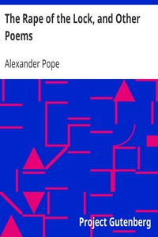

# The Rape of the Lock, and Other Poems <kbd>v2.0.2</kbd>

## Authors

 - Pope, Alexander <small>(1688 - 1744)</small>

## Translators

## Subjects

 - Catholics
 - English poetry
 - Young women

## Readablility

 - **A1:** 44%
 - **A2:** 51%
 - **B1:** 61%
 - **B2:** 77%
 - **C1:** 81%
 - **C2:** 100%

## Words Count

 - **A1:** 566
 - **A2:** 544
 - **B1:** 894
 - **B2:** 1384
 - **C1:** 577
 - **C2:** 4531

## Source

<kbd>GUTHENBURGE:9800</kbd>
