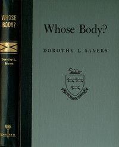

# Whose Body? A Lord Peter Wimsey Novel <kbd>v2.3.0</kbd>

## Authors

 - Sayers, Dorothy L. (Dorothy Leigh) <small>(1893 - 1957)</small>

## Translators

## Subjects

 - Detective and mystery stories
 - Murder
 - Private investigators
 - Wimsey, Peter, Lord (Fictitious character), 1890-

## Readablility

 - **A1:** 77%
 - **A2:** 82%
 - **B1:** 88%
 - **B2:** 93%
 - **C1:** 98%
 - **C2:** 100%

## Words Count

 - **A1:** 492
 - **A2:** 461
 - **B1:** 785
 - **B2:** 1152
 - **C1:** 1204
 - **C2:** 726

## Source

<kbd>GUTHENBURGE:58820</kbd>
