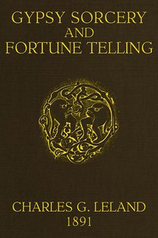

# Gypsy Sorcery and Fortune Telling: Illustrated by numerous incantations, specimens of medical magic, anecdotes and tales <kbd>v2.3.0</kbd>

## Authors

 - Leland, Charles Godfrey <small>(1824 - 1903)</small>

## Translators

## Subjects

 - Fortune-telling
 - Magic, Romani
 - Romanies

## Readablility

 - **A1:** 74%
 - **A2:** 80%
 - **B1:** 85%
 - **B2:** 91%
 - **C1:** 96%
 - **C2:** 100%

## Words Count

 - **A1:** 495
 - **A2:** 478
 - **B1:** 887
 - **B2:** 1427
 - **C1:** 1743
 - **C2:** 1253

## Source

<kbd>GUTHENBURGE:58465</kbd>
