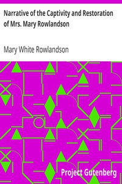

# Narrative of the Captivity and Restoration of Mrs. Mary Rowlandson <kbd>v2.2.1</kbd>

## Authors

 - Rowlandson, Mary White <small>(-1 - 1711)</small>

## Translators

## Subjects

 - Indian captivities
 - King Philip's War, 1675-1676
 - Lancaster (Mass.)
 - Massachusetts
 - Rowlandson, Mary White, approximately 1635-1711

## Readablility

 - **A1:** 80%
 - **A2:** 86%
 - **B1:** 91%
 - **B2:** 95%
 - **C1:** 99%
 - **C2:** 100%

## Words Count

 - **A1:** 443
 - **A2:** 295
 - **B1:** 427
 - **B2:** 505
 - **C1:** 405
 - **C2:** 158

## Source

<kbd>GUTHENBURGE:851</kbd>
