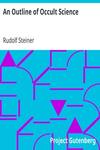

# An Outline of Occult Science <kbd>v2.2.1</kbd>

## Authors

 - Steiner, Rudolf <small>(1861 - 1925)</small>

## Translators

## Subjects

 - Anthroposophy
 - Occultism
 - Theosophy

## Readablility

 - **A1:** 74%
 - **A2:** 80%
 - **B1:** 86%
 - **B2:** 93%
 - **C1:** 97%
 - **C2:** 100%

## Words Count

 - **A1:** 469
 - **A2:** 390
 - **B1:** 652
 - **B2:** 983
 - **C1:** 1151
 - **C2:** 739

## Source

<kbd>GUTHENBURGE:30718</kbd>
