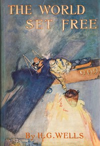

# The World Set Free <kbd>v2.2.1</kbd>

## Authors

 - Wells, H. G. (Herbert George) <small>(1866 - 1946)</small>

## Translators

## Subjects

 - Imaginary wars and battles
 - Nuclear warfare
 - War stories

## Readablility

 - **A1:** 74%
 - **A2:** 80%
 - **B1:** 85%
 - **B2:** 92%
 - **C1:** 97%
 - **C2:** 100%

## Words Count

 - **A1:** 489
 - **A2:** 473
 - **B1:** 860
 - **B2:** 1386
 - **C1:** 1675
 - **C2:** 1164

## Source

<kbd>GUTHENBURGE:1059</kbd>
