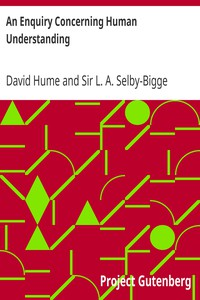

# An Enquiry Concerning Human Understanding <kbd>v2.3.0</kbd>

## Authors

 - Hume, David <small>(1711 - 1776)</small>

## Translators

## Subjects

 - Ethics
 - Knowledge, Theory of

## Readablility

 - **A1:** 71%
 - **A2:** 78%
 - **B1:** 85%
 - **B2:** 93%
 - **C1:** 98%
 - **C2:** 100%

## Words Count

 - **A1:** 455
 - **A2:** 378
 - **B1:** 622
 - **B2:** 912
 - **C1:** 929
 - **C2:** 541

## Source

<kbd>GUTHENBURGE:9662</kbd>
