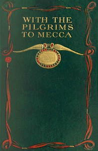

# With the pilgrims to Mecca: The great pilgrimage of A.H. 1319; A.D. 1902 <kbd>v2.2.1</kbd>

## Authors

 - Sparroy, Wilfrid <small>(-1 - -1)</small>
 - Khan, Hadji (Gazanfar Ali) <small>(-1 - -1)</small>

## Translators

## Subjects

 - Mecca (Saudi Arabia)
 - Pilgrims and pilgrimages

## Readablility

 - **A1:** 74%
 - **A2:** 80%
 - **B1:** 86%
 - **B2:** 92%
 - **C1:** 97%
 - **C2:** 100%

## Words Count

 - **A1:** 493
 - **A2:** 484
 - **B1:** 894
 - **B2:** 1464
 - **C1:** 1775
 - **C2:** 1202

## Source

<kbd>GUTHENBURGE:68124</kbd>
