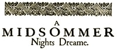

# A Midsummer Night's Dream <kbd>v2.0.2</kbd>

## Authors

 - Shakespeare, William <small>(1564 - 1616)</small>

## Translators

## Subjects

 - Athens (Greece)
 - Comedies
 - Courtship
 - Fairy plays

## Readablility

 - **A1:** 45%
 - **A2:** 51%
 - **B1:** 62%
 - **B2:** 76%
 - **C1:** 80%
 - **C2:** 100%

## Words Count

 - **A1:** 402
 - **A2:** 264
 - **B1:** 440
 - **B2:** 576
 - **C1:** 238
 - **C2:** 1667

## Source

<kbd>GUTHENBURGE:1514</kbd>
