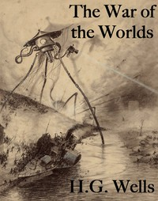

# The War of the Worlds <kbd>v2.1.0</kbd>

## Authors

 - Wells, H. G. (Herbert George) <small>(1866 - 1946)</small>

## Translators

## Subjects

 - Imaginary wars and battles
 - Life on other planets
 - Mars (Planet)
 - Martians
 - Science fiction
 - Space warfare
 - War stories

## Readablility

 - **A1:** 66%
 - **A2:** 73%
 - **B1:** 79%
 - **B2:** 85%
 - **C1:** 87%
 - **C2:** 100%

## Words Count

 - **A1:** 777
 - **A2:** 579
 - **B1:** 843
 - **B2:** 1089
 - **C1:** 396
 - **C2:** 3486

## Source

<kbd>GUTHENBURGE:36</kbd>
