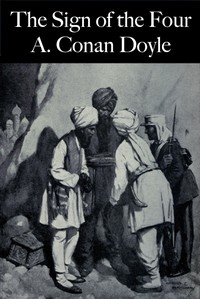

# The Sign of the Four <kbd>v2.0.9</kbd>

## Authors

 - Doyle, Arthur Conan <small>(1859 - 1930)</small>

## Translators

## Subjects

 - Detective and mystery stories
 - Holmes, Sherlock (Fictitious character)
 - Private investigators

## Readablility

 - **A1:** 71%
 - **A2:** 77%
 - **B1:** 83%
 - **B2:** 88%
 - **C1:** 89%
 - **C2:** 100%

## Words Count

 - **A1:** 752
 - **A2:** 558
 - **B1:** 799
 - **B2:** 876
 - **C1:** 311
 - **C2:** 2478

## Source

<kbd>GUTHENBURGE:2097</kbd>
