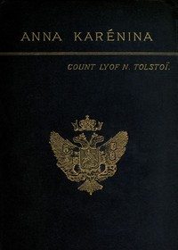

# Anna Karenina <kbd>v2.0.2</kbd>

## Authors

 - Tolstoy, Leo, graf <small>(1828 - 1910)</small>

## Translators

 - Garnett, Constance <small>(1861 - 1946)</small>

## Subjects

 - Adultery
 - Didactic fiction
 - Love stories
 - Married women
 - Russia

## Readablility

 - **A1:** 55%
 - **A2:** 62%
 - **B1:** 72%
 - **B2:** 84%
 - **C1:** 87%
 - **C2:** 100%

## Words Count

 - **A1:** 643
 - **A2:** 702
 - **B1:** 1225
 - **B2:** 2097
 - **C1:** 927
 - **C2:** 7813

## Source

<kbd>GUTHENBURGE:1399</kbd>
