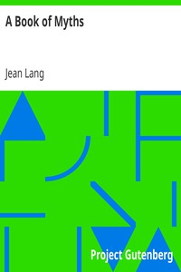

# A Book of Myths <kbd>v2.2.1</kbd>

## Authors

 - Lang, Jean <small>(1867 - 1932)</small>

## Translators

## Subjects

 - Mythology
 - Mythology, Greek

## Readablility

 - **A1:** 75%
 - **A2:** 81%
 - **B1:** 87%
 - **B2:** 93%
 - **C1:** 97%
 - **C2:** 100%

## Words Count

 - **A1:** 492
 - **A2:** 441
 - **B1:** 767
 - **B2:** 1170
 - **C1:** 1448
 - **C2:** 1063

## Source

<kbd>GUTHENBURGE:22693</kbd>
