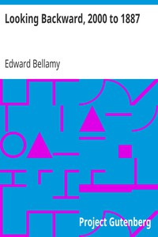

# Looking Backward, 2000 to 1887 <kbd>v2.2.1</kbd>

## Authors

 - Bellamy, Edward <small>(1850 - 1898)</small>

## Translators

## Subjects

 - Boston (Mass.)
 - Science fiction
 - Social problems
 - Time travel
 - Two thousand, A.D.
 - Utopian fiction
 - Utopias

## Readablility

 - **A1:** 75%
 - **A2:** 81%
 - **B1:** 87%
 - **B2:** 93%
 - **C1:** 98%
 - **C2:** 100%

## Words Count

 - **A1:** 489
 - **A2:** 479
 - **B1:** 842
 - **B2:** 1359
 - **C1:** 1615
 - **C2:** 972

## Source

<kbd>GUTHENBURGE:624</kbd>
