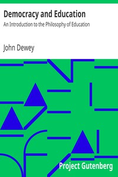

# Democracy and Education: An Introduction to the Philosophy of Education <kbd>v2.0.9</kbd>

## Authors

 - Dewey, John <small>(1859 - 1952)</small>

## Translators

## Subjects

 - Education
 - Education

## Readablility

 - **A1:** 66%
 - **A2:** 76%
 - **B1:** 83%
 - **B2:** 90%
 - **C1:** 92%
 - **C2:** 100%

## Words Count

 - **A1:** 835
 - **A2:** 709
 - **B1:** 1042
 - **B2:** 1490
 - **C1:** 499
 - **C2:** 3780

## Source

<kbd>GUTHENBURGE:852</kbd>
