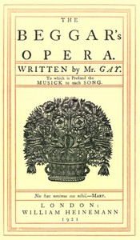

# The Beggar's Opera; to Which is Prefixed the Musick to Each Song <kbd>v2.2.1</kbd>

## Authors

 - Gay, John <small>(1685 - 1732)</small>

## Translators

## Subjects

 - Ballad operas

## Readablility

 - **A1:** 77%
 - **A2:** 83%
 - **B1:** 88%
 - **B2:** 93%
 - **C1:** 98%
 - **C2:** 100%

## Words Count

 - **A1:** 459
 - **A2:** 343
 - **B1:** 517
 - **B2:** 642
 - **C1:** 586
 - **C2:** 342

## Source

<kbd>GUTHENBURGE:25063</kbd>
