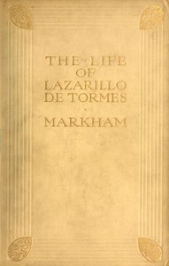

# The Life of Lazarillo de Tormes: His Fortunes & Adversities; with a Notice of the Mendoza Family, a Short Life of the Author, Don Diego Hurtado De Mendoza, a Notice of the Work, and Some Remarks on the Character of Lazarillo de Tormes <kbd>v2.3.0</kbd>

## Authors

 - Anonymous <small>(-1 - -1)</small>

## Translators

 - Markham, Clements R. (Clements Robert), Sir <small>(1830 - 1916)</small>

## Subjects

 - Picaresque fiction
 - Spanish fiction

## Readablility

 - **A1:** 77%
 - **A2:** 83%
 - **B1:** 89%
 - **B2:** 94%
 - **C1:** 98%
 - **C2:** 100%

## Words Count

 - **A1:** 479
 - **A2:** 375
 - **B1:** 565
 - **B2:** 698
 - **C1:** 570
 - **C2:** 292

## Source

<kbd>GUTHENBURGE:53489</kbd>
