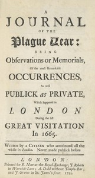

# A Journal of the Plague Year: Being Observations or Memorials of the Most Remarkable Occurrences, as Well Public as Private, Which Happened in London During the Last Great Visitation in 1665. Written by a Citizen Who Continued All the While in London <kbd>v2.2.1</kbd>

## Authors

 - Defoe, Daniel <small>(-1 - 1731)</small>

## Translators

## Subjects

 - Great Fire, London, England, 1666
 - Historical fiction
 - London (England)
 - Plague

## Readablility

 - **A1:** 80%
 - **A2:** 86%
 - **B1:** 91%
 - **B2:** 95%
 - **C1:** 98%
 - **C2:** 100%

## Words Count

 - **A1:** 486
 - **A2:** 439
 - **B1:** 753
 - **B2:** 1065
 - **C1:** 1063
 - **C2:** 564

## Source

<kbd>GUTHENBURGE:376</kbd>
