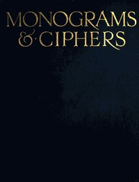

# Monograms & Ciphers <kbd>v2.3.0</kbd>

## Authors

 - Carlton Studio <small>(-1 - -1)</small>
 - Turbayne, A. A. (Albert Angus) <small>(1866 - 1940)</small>

## Translators

## Subjects

 - Monograms

## Readablility

 - **A1:** 70%
 - **A2:** 78%
 - **B1:** 84%
 - **B2:** 93%
 - **C1:** 98%
 - **C2:** 99%

## Words Count

 - **A1:** 289
 - **A2:** 149
 - **B1:** 213
 - **B2:** 239
 - **C1:** 155
 - **C2:** 81

## Source

<kbd>GUTHENBURGE:40023</kbd>
