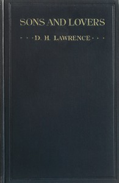

# Sons and Lovers <kbd>v2.3.0</kbd>

## Authors

 - Lawrence, D. H. (David Herbert) <small>(1885 - 1930)</small>

## Translators

## Subjects

 - Autobiographical fiction
 - Bildungsromans
 - Domestic fiction
 - England
 - Working class families
 - Young men

## Readablility

 - **A1:** 79%
 - **A2:** 85%
 - **B1:** 90%
 - **B2:** 95%
 - **C1:** 98%
 - **C2:** 100%

## Words Count

 - **A1:** 494
 - **A2:** 474
 - **B1:** 849
 - **B2:** 1380
 - **C1:** 1803
 - **C2:** 1384

## Source

<kbd>GUTHENBURGE:217</kbd>
