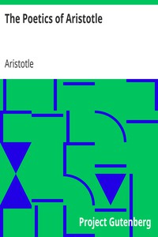

# The Poetics of Aristotle <kbd>v2.3.0</kbd>

## Authors

 - Aristotle <small>(-384 - -322)</small>

## Translators

 - Butcher, S. H. (Samuel Henry) <small>(1850 - 1910)</small>

## Subjects

 - Aesthetics
 - Poetry

## Readablility

 - **A1:** 72%
 - **A2:** 78%
 - **B1:** 84%
 - **B2:** 91%
 - **C1:** 96%
 - **C2:** 99%

## Words Count

 - **A1:** 418
 - **A2:** 249
 - **B1:** 379
 - **B2:** 491
 - **C1:** 389
 - **C2:** 204

## Source

<kbd>GUTHENBURGE:1974</kbd>
