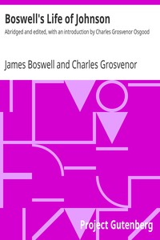

# Boswell's Life of Johnson: Abridged and edited, with an introduction by Charles Grosvenor Osgood <kbd>v2.2.1</kbd>

## Authors

 - Boswell, James <small>(1740 - 1795)</small>

## Translators

## Subjects

 - Authors, English
 - Critics
 - Johnson, Samuel, 1709-1784
 - Lexicographers

## Readablility

 - **A1:** 78%
 - **A2:** 84%
 - **B1:** 89%
 - **B2:** 94%
 - **C1:** 98%
 - **C2:** 100%

## Words Count

 - **A1:** 493
 - **A2:** 493
 - **B1:** 952
 - **B2:** 1631
 - **C1:** 2307
 - **C2:** 1703

## Source

<kbd>GUTHENBURGE:1564</kbd>
