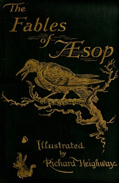

# The Fables of Aesop: Selected, Told Anew, and Their History Traced <kbd>v2.3.0</kbd>

## Authors

 - Aesop <small>(-1 - -1)</small>

## Translators

## Subjects

 - Aesop's fables
 - Fables, Greek

## Readablility

 - **A1:** 74%
 - **A2:** 80%
 - **B1:** 87%
 - **B2:** 92%
 - **C1:** 98%
 - **C2:** 100%

## Words Count

 - **A1:** 463
 - **A2:** 331
 - **B1:** 475
 - **B2:** 519
 - **C1:** 436
 - **C2:** 183

## Source

<kbd>GUTHENBURGE:28</kbd>
