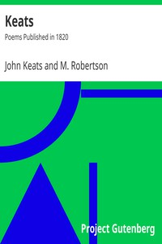

# Keats: Poems Published in 1820 <kbd>v2.3.0</kbd>

## Authors

 - Keats, John <small>(1795 - 1821)</small>

## Translators

## Subjects

 - English poetry

## Readablility

 - **A1:** 72%
 - **A2:** 78%
 - **B1:** 84%
 - **B2:** 90%
 - **C1:** 96%
 - **C2:** 100%

## Words Count

 - **A1:** 491
 - **A2:** 426
 - **B1:** 715
 - **B2:** 1048
 - **C1:** 1225
 - **C2:** 898

## Source

<kbd>GUTHENBURGE:23684</kbd>
