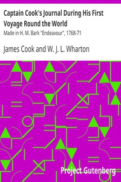

# Captain Cook's Journal During His First Voyage Round the World: Made in H. M. Bark "Endeavour", 1768-71 <kbd>v2.3.0</kbd>

## Authors

 - Cook, James <small>(1728 - 1779)</small>

## Translators

## Subjects

 - Oceania
 - Voyages around the world

## Readablility

 - **A1:** 72%
 - **A2:** 83%
 - **B1:** 89%
 - **B2:** 94%
 - **C1:** 98%
 - **C2:** 100%

## Words Count

 - **A1:** 487
 - **A2:** 466
 - **B1:** 836
 - **B2:** 1315
 - **C1:** 1451
 - **C2:** 905

## Source

<kbd>GUTHENBURGE:8106</kbd>
