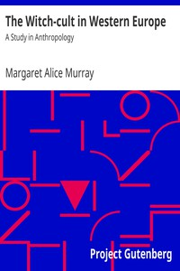

# The Witch-cult in Western Europe: A Study in Anthropology <kbd>v2.2.1</kbd>

## Authors

 - Murray, Margaret Alice <small>(1863 - 1963)</small>

## Translators

## Subjects

 - Ethnology
 - Witchcraft

## Readablility

 - **A1:** 79%
 - **A2:** 83%
 - **B1:** 89%
 - **B2:** 93%
 - **C1:** 96%
 - **C2:** 100%

## Words Count

 - **A1:** 486
 - **A2:** 445
 - **B1:** 761
 - **B2:** 1046
 - **C1:** 1170
 - **C2:** 852

## Source

<kbd>GUTHENBURGE:20411</kbd>
