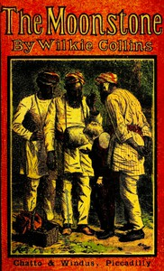

# The Moonstone <kbd>v2.0.2</kbd>

## Authors

 - Collins, Wilkie <small>(1824 - 1889)</small>

## Translators

## Subjects

 - Country homes
 - East Indians
 - England
 - Jewelry theft
 - Mystery fiction
 - Police

## Readablility

 - **A1:** 55%
 - **A2:** 63%
 - **B1:** 73%
 - **B2:** 86%
 - **C1:** 89%
 - **C2:** 100%

## Words Count

 - **A1:** 625
 - **A2:** 614
 - **B1:** 1104
 - **B2:** 1702
 - **C1:** 752
 - **C2:** 4460

## Source

<kbd>GUTHENBURGE:155</kbd>
