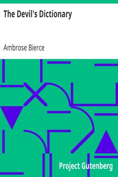

# The Devil's Dictionary <kbd>GUTHENBURGE</kbd>

## Authors

 - Bierce, Ambrose <small>(1842 - 1913)</small>

## Translators

## Subjects

 - English language
 - English language
 - Vocabulary

## Readablility

 - **A1:** 36%
 - **A2:** 48%
 - **B1:** 63%
 - **B2:** 78%
 - **C1:** 91%
 - **C2:** 100%

## Words Count

 - **A1:** 408
 - **A2:** 472
 - **B1:** 861
 - **B2:** 1400
 - **C1:** 1795
 - **C2:** 1571
