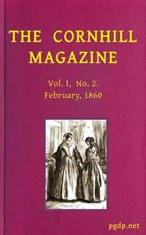

# The Cornhill Magazine, February, 1860 (Vol. I, No. 2) <kbd>v2.3.0</kbd>

## Authors

 - Various <small>(-1 - -1)</small>

## Translators

## Subjects

## Readablility

 - **A1:** 76%
 - **A2:** 82%
 - **B1:** 87%
 - **B2:** 93%
 - **C1:** 97%
 - **C2:** 100%

## Words Count

 - **A1:** 494
 - **A2:** 494
 - **B1:** 925
 - **B2:** 1495
 - **C1:** 1725
 - **C2:** 1246

## Source

<kbd>GUTHENBURGE:68175</kbd>
