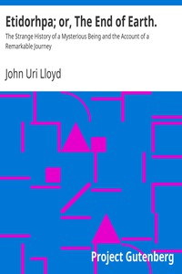

# Etidorhpa; or, The End of Earth.: The Strange History of a Mysterious Being and the Account of a Remarkable Journey <kbd>v2.3.0</kbd>

## Authors

 - Lloyd, John Uri <small>(1849 - 1936)</small>

## Translators

## Subjects

 - Earth (Planet)
 - Fantasy fiction
 - Occultism
 - Science fiction

## Readablility

 - **A1:** 72%
 - **A2:** 77%
 - **B1:** 85%
 - **B2:** 91%
 - **C1:** 97%
 - **C2:** 100%

## Words Count

 - **A1:** 494
 - **A2:** 476
 - **B1:** 903
 - **B2:** 1572
 - **C1:** 2038
 - **C2:** 1736

## Source

<kbd>GUTHENBURGE:37775</kbd>
