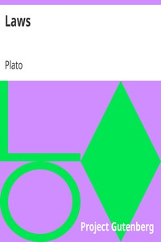

# Laws <kbd>v2.3.0</kbd>

## Authors

 - Plato <small>(-428 - -348)</small>

## Translators

 - Jowett, Benjamin <small>(1817 - 1893)</small>

## Subjects

 - Political science
 - State, The

## Readablility

 - **A1:** 77%
 - **A2:** 83%
 - **B1:** 89%
 - **B2:** 94%
 - **C1:** 98%
 - **C2:** 100%

## Words Count

 - **A1:** 489
 - **A2:** 460
 - **B1:** 871
 - **B2:** 1463
 - **C1:** 1940
 - **C2:** 1359

## Source

<kbd>GUTHENBURGE:1750</kbd>
