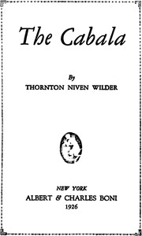

# The Cabala <kbd>v2.3.0</kbd>

## Authors

 - Wilder, Thornton <small>(1897 - 1975)</small>

## Translators

## Subjects

 - Americans
 - Rome (Italy)
 - Upper class

## Readablility

 - **A1:** 76%
 - **A2:** 82%
 - **B1:** 88%
 - **B2:** 93%
 - **C1:** 98%
 - **C2:** 100%

## Words Count

 - **A1:** 492
 - **A2:** 470
 - **B1:** 787
 - **B2:** 1154
 - **C1:** 1245
 - **C2:** 793

## Source

<kbd>GUTHENBURGE:68105</kbd>
