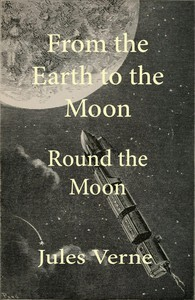

# From the Earth to the Moon; and, Round the Moon <kbd>v2.2.1</kbd>

## Authors

 - Verne, Jules <small>(1828 - 1905)</small>

## Translators

## Subjects

 - Manned space flight
 - Moon
 - Science fiction
 - Space flight to the moon
 - Space ships

## Readablility

 - **A1:** 72%
 - **A2:** 78%
 - **B1:** 85%
 - **B2:** 92%
 - **C1:** 96%
 - **C2:** 100%

## Words Count

 - **A1:** 483
 - **A2:** 463
 - **B1:** 848
 - **B2:** 1342
 - **C1:** 1597
 - **C2:** 1073

## Source

<kbd>GUTHENBURGE:83</kbd>
