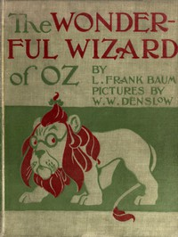

# The Wonderful Wizard of Oz <kbd>v2.2.0</kbd>

## Authors

 - Baum, L. Frank (Lyman Frank) <small>(1856 - 1919)</small>

## Translators

## Subjects

 - Courage
 - Cowardly Lion (Fictitious character)
 - Cyclones
 - Dreams
 - Fantasy literature
 - Gale, Dorothy (Fictitious character)
 - Good and evil
 - Home
 - Oz (Imaginary place)
 - Scarecrow (Fictitious character from Baum)
 - Tin Woodman (Fictitious character)
 - Toto (Fictitious character)
 - Witches
 - Wizard of Oz (Fictitious character)

## Readablility

 - **A1:** 77%
 - **A2:** 83%
 - **B1:** 89%
 - **B2:** 94%
 - **C1:** 98%
 - **C2:** 100%

## Words Count

 - **A1:** 1043
 - **A2:** 380
 - **B1:** 558
 - **B2:** 666
 - **C1:** 537
 - **C2:** 202

## Source

<kbd>GUTHENBURGE:55</kbd>
