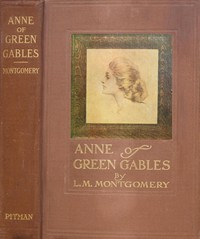

# Anne of Green Gables <kbd>v2.2.0</kbd>

## Authors

 - Montgomery, L. M. (Lucy Maud) <small>(1874 - 1942)</small>

## Translators

## Subjects

 - Bildungsromans
 - Canada
 - Country life
 - Friendship
 - Girls
 - Islands
 - Orphans
 - Prince Edward Island
 - Shirley, Anne (Fictitious character)

## Readablility

 - **A1:** 79%
 - **A2:** 85%
 - **B1:** 90%
 - **B2:** 94%
 - **C1:** 98%
 - **C2:** 100%

## Words Count

 - **A1:** 2918
 - **A2:** 468
 - **B1:** 817
 - **B2:** 1281
 - **C1:** 1456
 - **C2:** 932

## Source

<kbd>GUTHENBURGE:45</kbd>
