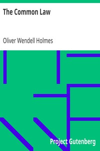

# The Common Law <kbd>v2.3.0</kbd>

## Authors

 - Holmes, Oliver Wendell <small>(1841 - 1935)</small>

## Translators

## Subjects

 - Common law

## Readablility

 - **A1:** 75%
 - **A2:** 81%
 - **B1:** 87%
 - **B2:** 93%
 - **C1:** 97%
 - **C2:** 100%

## Words Count

 - **A1:** 480
 - **A2:** 419
 - **B1:** 709
 - **B2:** 1084
 - **C1:** 1242
 - **C2:** 796

## Source

<kbd>GUTHENBURGE:2449</kbd>
