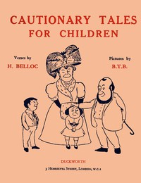

# Cautionary Tales for Children <kbd>v2.2.1</kbd>

## Authors

 - Belloc, Hilaire <small>(1870 - 1953)</small>

## Translators

## Subjects

 - Children's poetry, English
 - Conduct of life

## Readablility

 - **A1:** 70%
 - **A2:** 77%
 - **B1:** 85%
 - **B2:** 94%
 - **C1:** 99%
 - **C2:** 100%

## Words Count

 - **A1:** 351
 - **A2:** 178
 - **B1:** 249
 - **B2:** 286
 - **C1:** 182
 - **C2:** 51

## Source

<kbd>GUTHENBURGE:27424</kbd>
