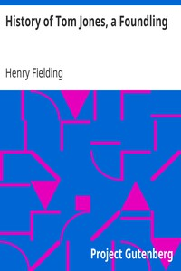

# History of Tom Jones, a Foundling <kbd>v2.2.1</kbd>

## Authors

 - Fielding, Henry <small>(1707 - 1754)</small>

## Translators

## Subjects

 - Bildungsromans
 - England
 - Foundlings
 - Humorous stories
 - Identity (Psychology)
 - Young men

## Readablility

 - **A1:** 77%
 - **A2:** 83%
 - **B1:** 89%
 - **B2:** 94%
 - **C1:** 98%
 - **C2:** 100%

## Words Count

 - **A1:** 493
 - **A2:** 492
 - **B1:** 940
 - **B2:** 1667
 - **C1:** 2388
 - **C2:** 1918

## Source

<kbd>GUTHENBURGE:6593</kbd>
