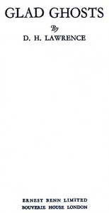

# Glad ghosts <kbd>v2.2.1</kbd>

## Authors

 - Lawrence, D. H. (David Herbert) <small>(1885 - 1930)</small>

## Translators

## Subjects

 - England
 - Ghost stories
 - Man-woman relationships

## Readablility

 - **A1:** 77%
 - **A2:** 83%
 - **B1:** 89%
 - **B2:** 94%
 - **C1:** 98%
 - **C2:** 100%

## Words Count

 - **A1:** 459
 - **A2:** 325
 - **B1:** 430
 - **B2:** 501
 - **C1:** 441
 - **C2:** 223

## Source

<kbd>GUTHENBURGE:68088</kbd>
