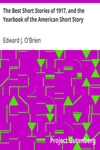

# The Best Short Stories of 1917, and the Yearbook of the American Short Story <kbd>v2.3.0</kbd>

## Authors

## Translators

## Subjects

 - American fiction
 - Short stories, American

## Readablility

 - **A1:** 77%
 - **A2:** 82%
 - **B1:** 88%
 - **B2:** 93%
 - **C1:** 97%
 - **C2:** 100%

## Words Count

 - **A1:** 496
 - **A2:** 496
 - **B1:** 977
 - **B2:** 1775
 - **C1:** 2657
 - **C2:** 2424

## Source

<kbd>GUTHENBURGE:20872</kbd>
