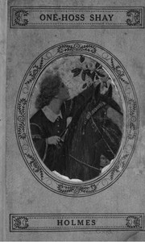

# The Wonderful "One-Hoss-Shay", and Other Poems <kbd>v2.2.1</kbd>

## Authors

 - Holmes, Oliver Wendell <small>(1809 - 1894)</small>

## Translators

## Subjects

 - American poetry

## Readablility

 - **A1:** 69%
 - **A2:** 77%
 - **B1:** 85%
 - **B2:** 92%
 - **C1:** 98%
 - **C2:** 100%

## Words Count

 - **A1:** 334
 - **A2:** 172
 - **B1:** 208
 - **B2:** 238
 - **C1:** 186
 - **C2:** 67

## Source

<kbd>GUTHENBURGE:45280</kbd>
