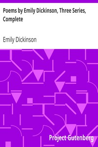

# Poems by Emily Dickinson, Three Series, Complete <kbd>v2.0.2</kbd>

## Authors

 - Dickinson, Emily <small>(1830 - 1886)</small>

## Translators

## Subjects

 - American poetry

## Readablility

 - **A1:** 46%
 - **A2:** 53%
 - **B1:** 64%
 - **B2:** 79%
 - **C1:** 83%
 - **C2:** 100%

## Words Count

 - **A1:** 494
 - **A2:** 436
 - **B1:** 683
 - **B2:** 1079
 - **C1:** 471
 - **C2:** 3075

## Source

<kbd>GUTHENBURGE:12242</kbd>
