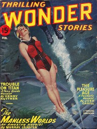

# Juke-Box <kbd>v2.0.2</kbd>

## Authors

 - Moore, C. L. (Catherine Lucile) <small>(1911 - 1987)</small>
 - Kuttner, Henry <small>(1915 - 1958)</small>

## Translators

## Subjects

 - Bars (Drinking establishments)
 - Jukeboxes
 - Science fiction
 - Short stories

## Readablility

 - **A1:** 47%
 - **A2:** 54%
 - **B1:** 66%
 - **B2:** 81%
 - **C1:** 86%
 - **C2:** 100%

## Words Count

 - **A1:** 363
 - **A2:** 209
 - **B1:** 313
 - **B2:** 360
 - **C1:** 136
 - **C2:** 515

## Source

<kbd>GUTHENBURGE:68107</kbd>
