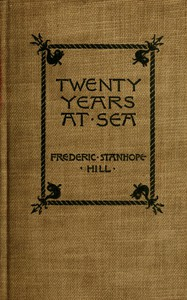

# Twenty years at sea: Leaves from my old log-books <kbd>v2.3.0</kbd>

## Authors

 - Hill, Frederic Stanhope <small>(1829 - 1913)</small>

## Translators

## Subjects

 - Hill, Frederic Stanhope, 1829-1913
 - Merchant marine
 - United States
 - Voyages and travels

## Readablility

 - **A1:** 73%
 - **A2:** 80%
 - **B1:** 86%
 - **B2:** 93%
 - **C1:** 97%
 - **C2:** 100%

## Words Count

 - **A1:** 485
 - **A2:** 446
 - **B1:** 790
 - **B2:** 1120
 - **C1:** 1107
 - **C2:** 674

## Source

<kbd>GUTHENBURGE:68103</kbd>
