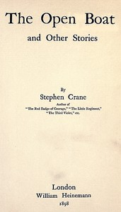

# The Open Boat and Other Stories <kbd>v2.3.0</kbd>

## Authors

 - Crane, Stephen <small>(1871 - 1900)</small>

## Translators

## Subjects

 - Short stories, American
 - United States

## Readablility

 - **A1:** 72%
 - **A2:** 79%
 - **B1:** 85%
 - **B2:** 92%
 - **C1:** 97%
 - **C2:** 100%

## Words Count

 - **A1:** 487
 - **A2:** 465
 - **B1:** 829
 - **B2:** 1287
 - **C1:** 1524
 - **C2:** 1093

## Source

<kbd>GUTHENBURGE:45524</kbd>
