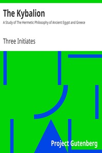

# The Kybalion: A Study of The Hermetic Philosophy of Ancient Egypt and Greece <kbd>v2.0.9</kbd>

## Authors

 - Three Initiates <small>(1862 - 1932)</small>

## Translators

## Subjects

 - Hermetism
 - Occultism

## Readablility

 - **A1:** 67%
 - **A2:** 75%
 - **B1:** 84%
 - **B2:** 90%
 - **C1:** 91%
 - **C2:** 100%

## Words Count

 - **A1:** 665
 - **A2:** 461
 - **B1:** 546
 - **B2:** 639
 - **C1:** 167
 - **C2:** 1186

## Source

<kbd>GUTHENBURGE:14209</kbd>
