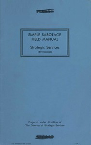

# Simple Sabotage Field Manual <kbd>v2.1.0</kbd>

## Authors

 - United States. Office of Strategic Services <small>(-1 - -1)</small>

## Translators

## Subjects

 - Sabotage

## Readablility

 - **A1:** 59%
 - **A2:** 68%
 - **B1:** 77%
 - **B2:** 86%
 - **C1:** 88%
 - **C2:** 100%

## Words Count

 - **A1:** 512
 - **A2:** 333
 - **B1:** 413
 - **B2:** 471
 - **C1:** 125
 - **C2:** 733

## Source

<kbd>GUTHENBURGE:26184</kbd>
