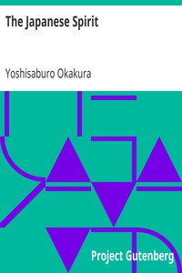

# The Japanese Spirit <kbd>v2.2.1</kbd>

## Authors

 - Okakura, Yoshisaburo <small>(1868 - 1936)</small>

## Translators

## Subjects

 - Ethics
 - Japan

## Readablility

 - **A1:** 72%
 - **A2:** 78%
 - **B1:** 85%
 - **B2:** 92%
 - **C1:** 97%
 - **C2:** 100%

## Words Count

 - **A1:** 464
 - **A2:** 399
 - **B1:** 592
 - **B2:** 775
 - **C1:** 798
 - **C2:** 472

## Source

<kbd>GUTHENBURGE:34341</kbd>
