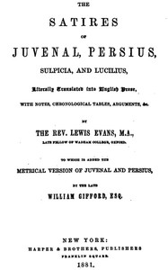

# The Satires of Juvenal, Persius, Sulpicia, and Lucilius: Literally translated into English prose, with notes, chronological tables, arguments, &c. <kbd>v2.2.1</kbd>

## Authors

 - Persius <small>(-1 - -1)</small>
 - Sulpicia <small>(-1 - -1)</small>
 - Juvenal <small>(-1 - -1)</small>
 - Lucilius, Gaius <small>(-1 - -1)</small>

## Translators

 - Gifford, William <small>(1756 - 1826)</small>
 - Evans, Lewis <small>(1814 - 1869)</small>

## Subjects

 - Juvenal
 - Verse satire, Latin

## Readablility

 - **A1:** 75%
 - **A2:** 79%
 - **B1:** 85%
 - **B2:** 91%
 - **C1:** 96%
 - **C2:** 100%

## Words Count

 - **A1:** 492
 - **A2:** 490
 - **B1:** 952
 - **B2:** 1740
 - **C1:** 2712
 - **C2:** 2916

## Source

<kbd>GUTHENBURGE:50657</kbd>
