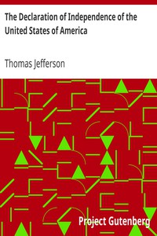

# The Declaration of Independence of the United States of America <kbd>v2.0.2</kbd>

## Authors

 - Jefferson, Thomas <small>(1743 - 1826)</small>

## Translators

## Subjects

 - United States
 - United States. Declaration of Independence

## Readablility

 - **A1:** 49%
 - **A2:** 57%
 - **B1:** 70%
 - **B2:** 85%
 - **C1:** 89%
 - **C2:** 100%

## Words Count

 - **A1:** 384
 - **A2:** 337
 - **B1:** 479
 - **B2:** 670
 - **C1:** 235
 - **C2:** 1079

## Source

<kbd>GUTHENBURGE:1</kbd>
